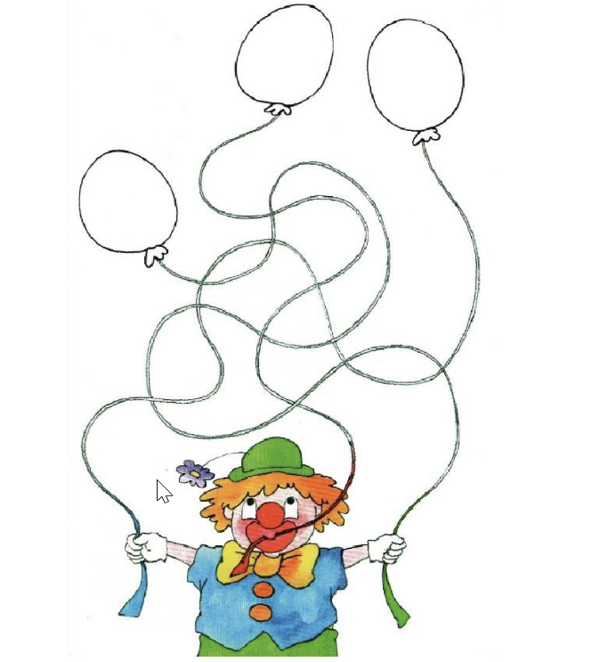
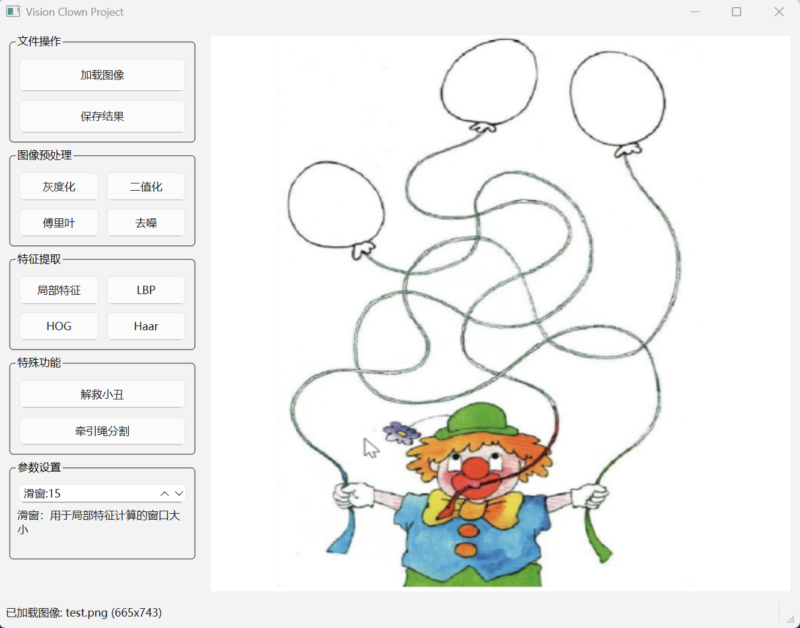
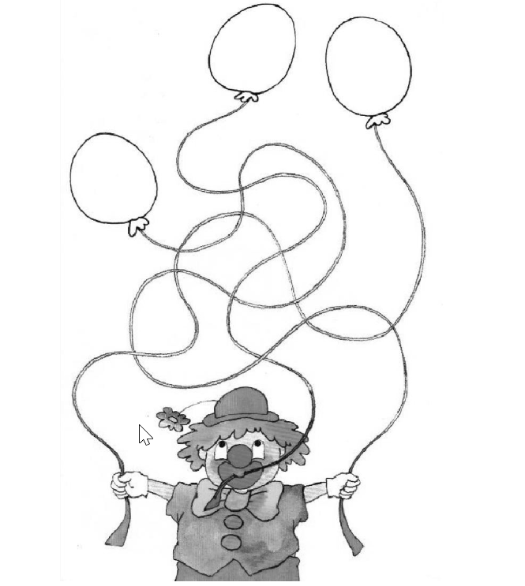
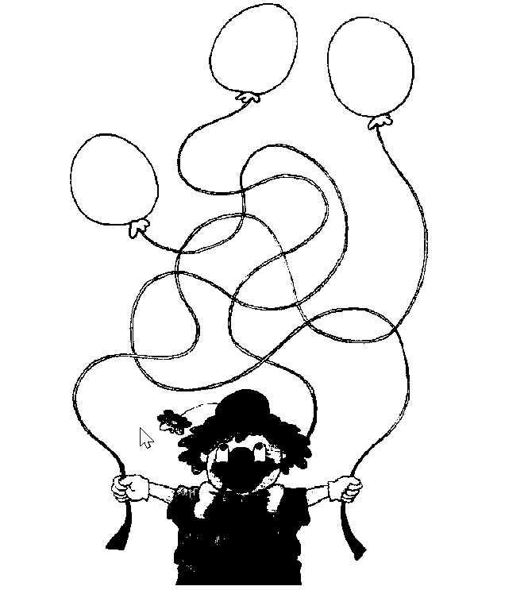
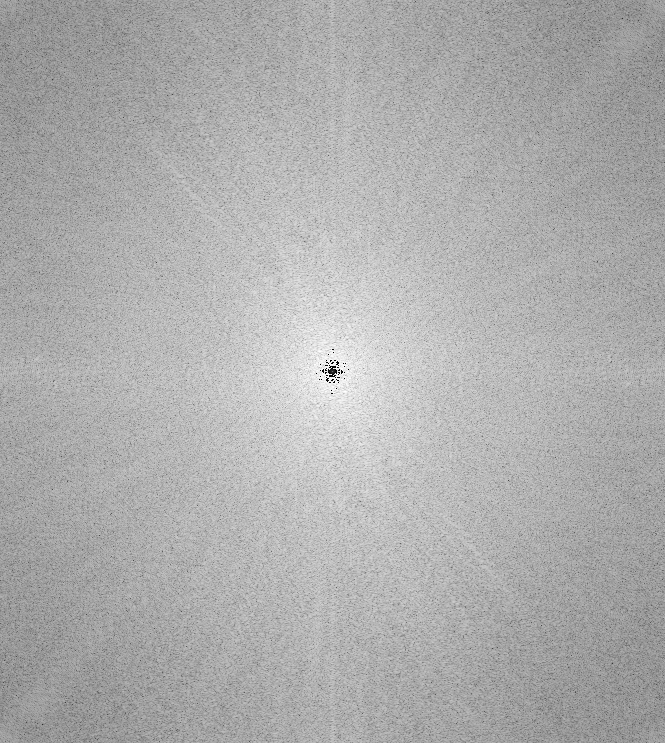
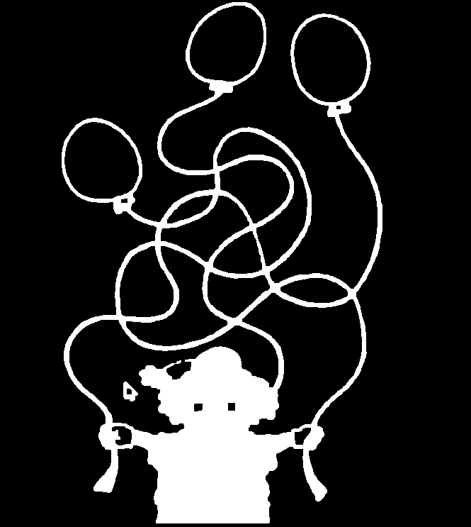
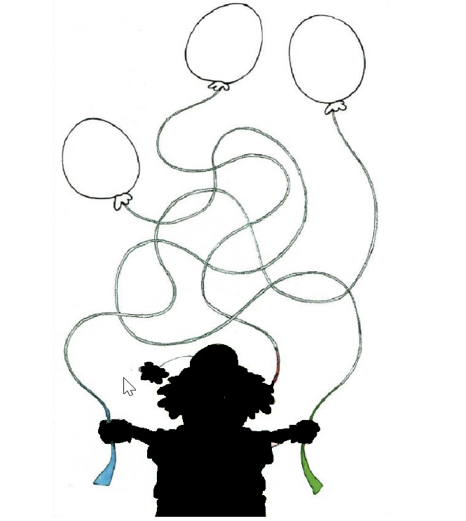

# 飞行器视觉技术课程作业（此为课程自动布置,不可能不做）

# Clown Vision Project

## 项目概述

Clown Vision Project 是一个基于计算机视觉技术的图像处理项目，旨在通过多种图像处理算法，对包含小丑、气球和牵引线的图像进行分析和处理。项目实现了从基础图像变换到高级特征提取和交互式处理的完整功能链路，提供了直观的图形用户界面便于操作和结果可视化。

## 任务描述

给定测试图片：



项目需要完成以下图像处理任务：

1. 图像灰度化；图像二值化处理，输出只有黑白两色的图像；对图像进行傅里叶变换，输出中心化的频谱图像
2. 图像去噪（背景为黑，小丑、气球、牵引绳标记为白色）
3. 使用自拟尺寸的滑框，计算自拟图像的局部均值、局部一阶矩、局部二阶矩、局信息熵，将计算值归一化到0-255的整数，输出灰度图像
4. 计算图像的LBP特征、Hog特征、harr特征，进行可视化
5. 解救小丑，输出只有气球及牵引线的彩色图像
6. 解开牵引绳，用不同的颜色标记三条牵引线

## 实现进度

使用opencv-python库实现图像处理，pyside6实现图形界面



- [X] 图像预处理（灰度化、二值化、傅里叶变换）
- [X] 图像去噪
- [ ] 局部特征计算（均值、一阶矩、二阶矩、信息熵）
- [ ] 图像特征计算（LBP、HOG、Haar特征）
- [X] 解救小丑
- [ ] 解开牵引绳

### 环境搭建

下载/fork仓库，进入目录

```powershell
git clone ....
#进入项目文件
cd clown_vision
```

**uv方式**

```powershell
#创建虚拟环境
uv venv --python 3.12
#激活环境
.venv\Scripts\activate
#安装依赖
uv add -r requirements.txt
```

**pip+venv方式**

```powershell
#创建虚拟环境
python -m venv .venv
#激活环境
.venv\Scripts\activate
#安装依赖
pip install -r requirements.txt
```

**conda方式**

```powershell
#创建环境
conda create -n [env_name] python=3.12
#激活环境
conda activate [env_name] 
#安装依赖
conda install -n [env_name] -c conda-forge [package_name]
```

### 项目框架（clown_vision下包含图像处理函数、ui）

```text
clown_vision/
├── clown_vision/
│   ├── __init__.py
│   ├── preprocessing.py       # 灰度化、二值化、傅里叶变换
│   ├── denoising.py           # 去噪
│   ├── local_features.py      # 局部均值/矩/熵计算
│   ├── descriptors.py         # LBP/HOG/Haar 特征
│   ├── rescue.py              # 解救小丑（只保留气球和线）
│   ├── untangle.py            # 解开三条线并着色
│   ├── ui.py                  # PySide6 UI界面
│   └── utils.py               # 工具函数（显示、保存等）
├── assets/
│   └── test.png               # 测试图像
├── tests/
│   ├── test_preprocessing.py  # 测试预处理函数
│   ├── test_denoising.py      # 测试去噪函数
│   ├── test_local_features.py # 测试局部特征函数
│   ├── test_descriptors.py    # 测试描述符函数
│   ├── test_rescue.py         # 测试解救函数
│   ├── test_untangle.py       # 测试解开函数
│   └── test_ui.py             # 测试UI函数
├── scripts/
│   └── run_ui.py              # 运行UI的脚本
├── pyproject.toml            # 项目配置和依赖管理
├── requirements.txt          # 依赖列表
└── README.md                 # 项目说明文档
```

## 实现原理与结果展示

### 1. 图像灰度化、图像二值化处理、图像进行傅里叶变换

**灰度化**：将RGB三通道图像转换为灰度图，公式为：Gray = 0.299R + 0.587G + 0.114B
**二值化处理**：将灰度图转换为二值图，通过设定阈值将像素值分为两种，阈值选取方法（固定阈值方法和ostu自动阈值方法）：

1. 固定阈值方法：将图像的像素值与阈值进行比较，将大于阈值的像素值设为255，小于阈值的像素值设为0。
2. ostu自动阈值方法：通过计算图像的灰度直方图，找到灰度值之间的最大方差，将灰度值分为两种，小于该方差值的像素值为0，大于该方差值的像素值为255。

**傅里叶变换**：将图像进行傅里叶变换，将图像的实部和虚部分别保存，并计算图像的频谱，将频谱的实部和虚部分别保存，并计算频谱的幅值和相位。

<div style="display: flex; justify-content: space-around;">
  
  
  
</div>

```python
def fourier_transform(gray):
    f = np.fft.fft2(gray)
    fshift = np.fft.fftshift(f)
    spectrum = 20 * np.log(np.abs(fshift) + 1)
    return spectrum.astype(np.uint8)
```

$F(u,v) = \sum_{x,y} f(x,y) e^{-2\pi i(ux+vy)}$
$F_{shift}(u,v) = F(u,v)\cdot (-1)^{u+v}$

$Mag_{db}=20\log(1+|F_{shift}(u,v)|)$

### 2. 图像去噪

通过高斯模糊、自适应二值化/固定阈值方法和形态学操作等步骤对图像进行去噪，保留主要目标（小丑、气球和牵引线），并将背景设置为黑色。



### 3. 局部特征计算

使用自拟尺寸的滑窗（局部窗口），在图像上滑动计算以下特征：
- 局部均值：窗口内像素值的平均值
- 局部一阶矩：窗口内像素值的分布中心
- 局部二阶矩：窗口内像素值的分布分散程度
- 局部信息熵：窗口内像素值分布的不确定性度量

将计算得到的特征值归一化到0-255的整数范围，输出为灰度图像

### 4. 图像特征提取

- LBP特征：局部二值模式，描述图像局部纹理特征
- HOG特征：方向梯度直方图，描述图像局部形状特征
- Haar特征：矩形特征，用于检测图像中的边缘、线条等特征

所有特征计算完成后进行可视化展示

### 5. 解救小丑

基于面向对象设计实现的小丑剔除功能，通过颜色特征自动检测、交互式鼠标框选和GrabCut算法分割，精确剔除小丑区域，保留气球和牵引线。

#### 实现原理
1. **自动检测**：将图像转换到HSV空间，利用小丑通常具有高饱和度、高亮度的鲜艳色彩特性，自动检测出可能的小丑区域
2. **GrabCut分割**：对检测区域应用GrabCut算法进行前景分割，生成初始掩码
3. **交互优化**：提供鼠标拖动框选功能，用户可手动补充选择遗漏的区域，每次框选后自动执行GrabCut并合并掩码
4. **结果生成**：合并所有分割掩码，反转后生成最终掩码，实现小丑区域剔除，保留气球和牵引线

#### 使用说明
- 程序启动时自动显示初始检测框
- 鼠标拖动框选需要保留的区域，松开鼠标自动执行GrabCut并合并掩码
- 按F键确认最终结果，按Q键退出操作



### 6. 解开牵引绳

使用图像处理算法识别并分离三条不同的牵引绳，然后用不同的颜色进行标记，清晰展示每条牵引绳的走向和位置

## 运行说明

在完成环境搭建后，可以通过以下命令运行程序：

```bash
cd clown_vision
python main.py
```

## 常见问题解答

### Q: 运行程序时出现"找不到模块"的错误怎么办？
A: 请确保已正确安装所有依赖包，可以使用`pip install -r requirements.txt`命令安装所需依赖。

### Q: "解救小丑"功能如何使用？
A: 点击界面上的"解救小丑"按钮后，系统会自动检测图像中的鲜艳区域。您可以通过鼠标框选需要保留的区域，然后按F键确认分割结果，按Q键退出操作。

### Q: 程序支持处理其他图片吗？
A: 目前程序主要针对测试图片进行优化，如需处理其他图片，可能需要调整部分算法参数。

### Q: 界面显示异常或响应缓慢怎么办？
A: 请确保您的计算机满足基本的硬件要求，并且关闭其他占用大量资源的程序。如果问题依然存在，可以尝试重启程序。
